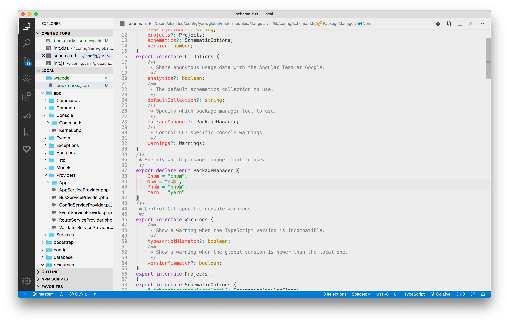

#  ECOS light theme for Visual Studio Code

# ● Screen shot

# ● Installation
1. Open the Extensions sidebar in VS Code
2. Search for **ECOS Theme**
3. Click Install
4. Open the Command Palette with Ctrl+Shift+P(Windows) or Command+Shift+P(Mac)
5. Select Preferences: Color Theme and choose a **ECOS**.
6. Enjoy!
